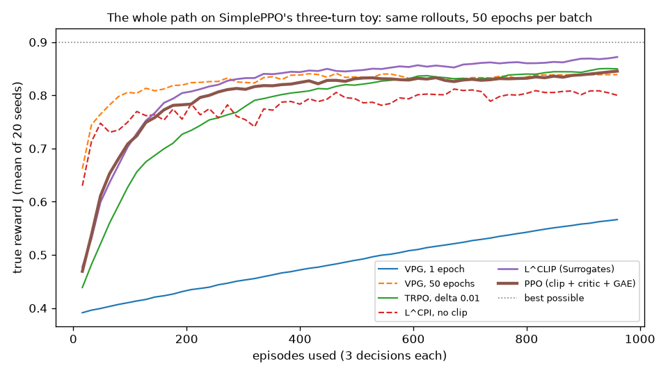

# RL algorithms, from scratch

Small, CPU-only implementations of the algorithms
[verl](https://github.com/volcengine/verl) trains LLMs with, plus the learning
ideas in [Agent0](https://arxiv.org/abs/2511.16043), which is built on verl.

Names, argument orders and return tuples follow verl's
[`trainer/ppo/core_algos.py`](https://github.com/volcengine/verl/blob/main/verl/trainer/ppo/core_algos.py)
and `utils/torch_functional.py`, so what you write here transfers to a real verl
trainer unchanged. The production systems add distributed workers, vLLM,
sandboxes and Ray; this repo keeps only the mechanisms worth understanding on
paper.

## The path

Two tracks. The first builds the PPO paper's argument (§2–§6) on a toy small
enough to compute exactly: one decision per question, a 2×2 table of logits,
then a three-turn version of the same agent for the paper's full PPO and for
GRPO. The
second takes PPO to verl's LLM interface, `(batch, response_length)` tensors,
and on to the algorithms built on top of it.

```
 TOY TRACK  (PPO paper §2–§6, the tool-calling agent)  LLM TRACK  (verl's core_algos.py API)

 1 VPG/          L^PG: which way is uphill             6 PPO/     the same PPO for LLMs: tokens, masks;
     │           flaw: valid for one epoch only                   then verl's extras (Part 2)
     ▼                                                     │
 2 TRPO/         ratio + KL rollback: reuse safely         ▼
     │           flaw: the limit is outside the loss   7 GRPO/    SimpleGRPO's advantage at verl's
     ▼                                                     │      shapes: uids, masks, a group of one
 3 Surrogates/   one loop, one slot, six candidates        ▼
     │           the clip wins, and THAT is PPO        8 Agent0/  GRPO trains the question writer; ADPO
     ▼                                                            (GRPO + difficulty scaling) the solver
 4 SimplePPO/    three decisions per question: a critic
     │           and GAE give each its credit; the paper's
     ▼           full PPO, with no tokens or masks
 5 SimpleGRPO/   the same agent, no critic: each question
     │           answered 8 times, each answer judged
     │           against the others; plus a KL to π_ref
     └──────────────────────────────────────────────►
```

Every algorithm here is the same loop, the paper's Algorithm 1: collect a batch
at θ_old, compute advantages once, then take a few epochs of gradient steps on
a loss. They differ only in **what goes in the loss slot** and **where the
advantage comes from**:

| Module | Slot (the policy loss) | Advantage  | Limit on each update |
|---|---|---|---|
| `VPG/` | L^PG = log π · Â (eq. 2) | reward − batch mean | none: 1 epoch only |
| `TRPO/` | L^CPI = r · Â (eq. 3), plus a rollback after every step | reward − batch mean | KL ≤ δ, checked outside the loss |
| `Surrogates/` | L^CPI, fixed-β KL, adaptive-β KL, L^CLIP (eq. 5–8) | reward − batch mean | none, β (a price), d_targ, or ε |
| `SimplePPO/` | L^CLIP + c1·L^VF − c2·S (eq. 9) | GAE, with a learned critic V(s) | ε, inside the loss |
| `SimpleGRPO/` | the same L^CLIP, imported from `SimplePPO/`, + β·KL(π_θ ‖ π_ref) | (episode reward − group mean) / group std | ε, inside the loss |
| `PPO/` | L^CLIP, verl's `compute_policy_loss` (+ dual-clip, asymmetric ε) | GAE, with a learned critic V(s) | ε, inside the loss |
| `GRPO/` | the same L^CLIP, imported from `PPO/` | (reward − group mean) / group std | ε, inside the loss |
| `Agent0/` | GRPO for the Curriculum Agent; ADPO for the Executor: L^CLIP with ε_high widened on hard questions | GRPO's, scaled by the question's difficulty | ε, set per question |

### The whole path in one figure

Every method on SimplePPO's three-turn toy, with the same rollouts and the same
optimizer (SGD, lr 0.3, 20 seeds), and 50 epochs per batch for every method that
reuses it. Regenerate it with `python SimplePPO/plot_path.py` (about five minutes).



| Method | Advantage | J after 60 iterations |
|---|---|---|
| VPG, 1 epoch per batch | episode reward − batch mean | 0.567 |
| VPG, the batch reused 50 epochs | same | 0.839 |
| L^CPI, no clip | same | 0.800 |
| TRPO, δ 0.01 | same | 0.850 |
| L^CLIP (Surrogates' winner) | same | **0.872** |
| PPO: L^CLIP + critic + GAE | critic + GAE | 0.846 |

- **Reusing each batch is the big win:** every method that reuses it beats one
  step per batch by far.
- **Reuse without a limit overshoots:** L^CPI ends lowest of the reusers and
  stays noisy; plain VPG plateaus early.
- **The limit makes heavy reuse safe:** TRPO's rollback does it, but climbs
  the slowest of the reusers; the clip does it inside the loss, and ends highest.
- **The critic doesn't pay on this toy.** Full PPO is slightly below the plain
  clip. With three turns, 12 states and very noisy rewards, the critic stays
  about 0.2 off the true values and lags the improving policy, so the batch
  mean is as good a baseline. The critic earns its place on longer episodes;
  on LLMs, where a response gets one reward, GRPO drops it altogether
  (`SimpleGRPO/` does that on this same agent).
- At 10 epochs instead of 50, nothing on this toy overshoots, and reused VPG
  matches PPO (0.860 vs 0.854). The methods only separate once the batch is
  pushed hard.

Read top to bottom, the modules add one idea each: *which way* → *reuse the
data* → *but stay close, cheaply* → *credit for several decisions, from a
critic* → *or from a group, without one* → *both at LLM scale* → *two agents
teaching each other*.

| # | Module | What you build in `from_scratch/` | Needs |
|---|---|---|---|
| 1 | `VPG/` | J(θ), the baseline advantage, L^PG, the update loop | — |
| 2 | `TRPO/` | the ratio surrogate, the exact KL, the update behind the KL constraint | VPG's toy |
| 3 | `Surrogates/` | L^CPI, the fixed and adaptive KL penalties, L^CLIP | VPG's toy, TRPO's `mean_kl` |
| 4 | `SimplePPO/` | GAE, your clip per step, the value loss and entropy, the minibatch loop: the paper's PPO | Surrogates, for the clip |
| 5 | `SimpleGRPO/` | the group advantage (and Dr.GRPO), the k3 KL to π_ref, the loop around your clip | SimplePPO, for the clip |
| 6 | `PPO/` | Part 1, core PPO: per-token log-probs, GAE, the clip per token, the value loss, entropy, and Algorithm 1 itself. Part 2, verl's extras: whitening, the four `loss_agg_mode`s, dual clip, clipped critic, the reference KL | VPG → Surrogates, for the ideas |
| 7 | `GRPO/` | the group-relative advantage at verl's shapes, and the Dr.GRPO flag | **your** PPO exercise, both parts; SimpleGRPO, for the idea |
| 8 | `Agent0/` | the self-consistency vote, the gate, the curriculum reward | — |

The terms each module's logs use are in its README (`VPG/README.md`,
`TRPO/README.md`, `Surrogates/README.md`, `SimplePPO/README.md`, `SimpleGRPO/README.md`,
`PPO/README.md`) or, for Agent0, in
`./scripts/run_agent0.sh overview`.

Each module has a reference implementation (`common.py`, or `vpg.py`,
`trpo.py`, `surrogates.py`, `simple_ppo.py` and `simple_grpo.py` on the toy track), a literal walkthrough
(`steps_*.py`), a runnable demonstration (`run_*.py`), and a staged exercise
under `from_scratch/`. Read them in that order, but solve the exercise without
opening the reference.

## Running it

```bash
pip install -r requirements.txt

./scripts/run_vpg.sh            # list the commands (the same for every module)
./scripts/run_vpg.sh check      # grade your from_scratch implementation
./scripts/run_vpg.sh steps      # the walkthrough, against the reference
./scripts/run_vpg.sh scratch    # the walkthrough, against your implementation
./scripts/run_vpg.sh run        # the demo
./scripts/run_vpg.sh diff       # prove yours matches the reference
```

`run_trpo.sh`, `run_surrogates.sh`, `run_simple_ppo.sh`, `run_simple_grpo.sh`, `run_ppo.sh`, `run_grpo.sh` and
`run_agent0.sh` take the same commands. The demos:

```bash
./scripts/run_vpg.sh run          # new rollouts every update vs reusing one batch
./scripts/run_trpo.sh run         # TRPO vs VPG: safe reuse, KL constraint outside the loss
./scripts/run_surrogates.sh run   # every slot in one loop: the toy's Table 1 (~3 min)
./scripts/run_simple_ppo.sh run   # the paper's PPO on three decisions, minus each piece (~1 min)
./scripts/run_simple_grpo.sh run  # GRPO on the same agent: Dr.GRPO, group size, no KL, vs PPO (~3 min)
python SimplePPO/plot_path.py     # the whole path, VPG to PPO, on one toy: PPO/ppo_path.png (~5 min)
./scripts/run_ppo.sh run          # Algorithm 1 on the token task, at verl's (batch, response_length) shapes
```

`Agent0` adds three commands of its own, since it is the only module training
two agents:

```bash
./scripts/run_agent0.sh overview     # the iteration flow, and a glossary
./scripts/run_agent0.sh trace        # one question through Step 3 and Step 4
./scripts/run_agent0.sh curriculum   # or executor, for one half at a time
```

Start with `overview`: it draws what generates what, who is frozen, and where
weights actually move, then defines every term the other scripts print.

Or call the files directly:

```bash
python VPG/steps_vpg.py                python VPG/run_vpg.py                python VPG/from_scratch/check.py
python TRPO/steps_trpo.py              python TRPO/run_trpo.py              python TRPO/from_scratch/check.py
python Surrogates/steps_surrogates.py  python Surrogates/run_surrogates.py  python Surrogates/from_scratch/check.py
python SimplePPO/steps_simple_ppo.py   python SimplePPO/run_simple_ppo.py   python SimplePPO/from_scratch/check.py
python SimpleGRPO/steps_simple_grpo.py python SimpleGRPO/run_simple_grpo.py python SimpleGRPO/from_scratch/check.py
python PPO/steps_ppo.py                python PPO/run_ppo.py                python PPO/from_scratch/check.py
python GRPO/steps_grpo.py              python GRPO/run_grpo.py              python GRPO/from_scratch/check.py
python Agent0/steps_agent0.py          python Agent0/run_agent0.py          python Agent0/from_scratch/check.py
```

`Agent0/` has one walkthrough per agent, and `steps_agent0.py` runs both in
dependency order:

```bash
python Agent0/steps_curriculum.py   # the proposer -- writes questions, GRPO
python Agent0/steps_executor.py    # the solver   -- answers them, ADPO
```

Set `RL_IMPL=scratch` to run any walkthrough against your own implementation
once its grader passes.

## The LLM track's convention

On the LLM track, everything outside `Agent0/`'s reward layer is `(batch, response_length)`, and
`response_mask` is the only thing that makes a position real. There is no
per-sequence scalar: one outcome reward for a whole response is a row that is
zero except at its last valid position. Every mean, variance and loss is taken
over the mask.

## From this toy to an LLM

The toy track uses a 2×2 table of logits as the policy. A real policy is
a neural network or a transformer, but the RL math does not change, because it
all starts from the logits:

| | State s_t | Action a_t | Logits come from |
|---|---|---|---|
| The toy track | question type (`qtype`) | answer / tool | `policy.logits[qtype]`, a table lookup |
| An MLP (e.g. CartPole) | observation vector | a move | `net(obs)` |
| An LLM | prompt + every token so far | the next token | `model(input_ids).logits` |

After the logits the code is the same: `log_softmax`, pick out the log-prob of
the action taken, then the ratio, clip, KL and loss. For an LLM, as in verl's
`logprobs_from_logits`:

```python
logits = model(input_ids, attention_mask).logits      # (B, T, V): one pass scores every position
logits = logits[:, prompt_len - 1:-1] / temperature   # the logits at t predict token t+1
log_prob = torch.log_softmax(logits, -1).gather(-1, responses.unsqueeze(-1)).squeeze(-1)  # (B, R)
```

That `(batch, response_length)` tensor, with `response_mask`, is what `PPO/`,
`GRPO/` and `Agent0/` take. The toy is the case R = 1, V = 2.

What gets harder is the engineering, not the math:

- **Every token is an action.** A 500-token response is 500 steps, and the
  state is the whole prefix. KL between whole sequences is intractable, so it is
  taken per token and averaged over the mask.
- **The exact KL does not fit in memory.** `TRPO/trpo.py`'s `mean_kl` sums over
  both actions. Over a ~152k vocabulary, one fp32 logits tensor for 8 × 4,096
  tokens is ~20 GB, and the sum needs the reference model's as well. verl keeps
  only the sampled token's log-prob and *estimates* the KL (k1 / k2 / k3 in
  `PPO/common.py`'s `kl_penalty`); its `"full"` mode raises
  `NotImplementedError`, as ours does.
- **Several forward passes.** vLLM samples the rollouts, the trainer recomputes
  `old_log_prob` (vLLM's numbers differ slightly), a frozen reference model gives
  `ref_log_prob`, and PPO also runs a critic. GRPO drops the critic mainly to
  save memory.
- **Sampling settings must match.** Rollouts sampled at temperature T need their
  log-probs computed from `logits / T`, or the ratio is not 1 at θ_old.
- **Not every token is the policy's.** Tool outputs sit inside an agentic
  response, but the model did not choose them; `response_mask` keeps them out
  of the ratio, the KL and the loss.
- **The paper's TRPO does not scale.** Its conjugate-gradient step needs
  Fisher-vector products over billions of parameters. PPO's clip needs only
  first-order SGD, which is why LLM training uses PPO and GRPO.

## Notes

There is no DPO module. verl ships no DPO trainer, so it sits outside what this
repo is mirroring; it was removed in the verl-alignment pass and remains in git
history.

The exercises were designed against the real code in verl and in
[aiming-lab/Agent0](https://github.com/aiming-lab/Agent0), which each module
cites by path in its docstrings. Where that code and its write-ups disagree,
this repo follows the code and says so in a comment — `Agent0/from_scratch/README.md`
lists four such places. Live model sampling, vLLM, the code sandbox and
sympy-based answer grading are deliberately represented by deterministic values
or by callbacks supplied by the caller.
